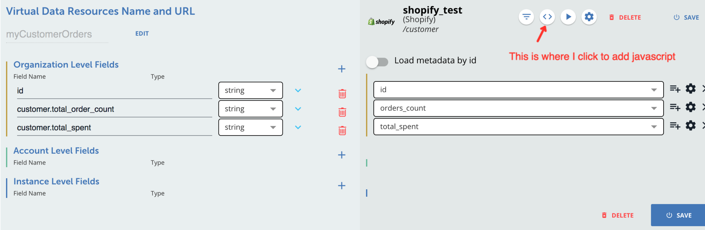
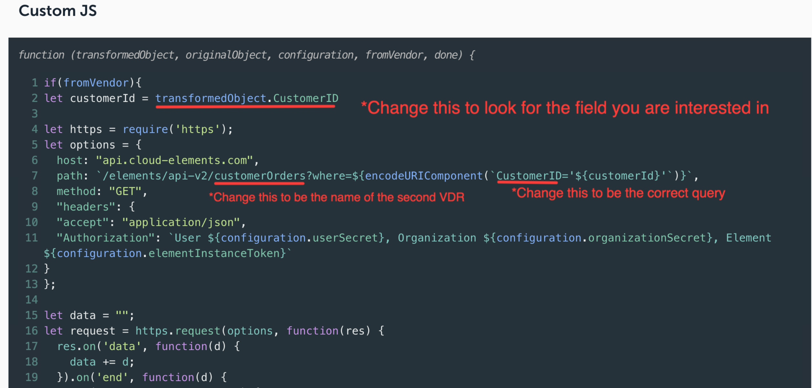

# Combining Various Objects Data in to a Single Virtual Data Resource (VDR)
This is an example for users familiar with Cloud Elements Virtual Data Resources to expand their resources to be able to combine data from various objects into a single resource. Or, in other words, instead of having to make a call to a /customers endpoint and then having to make a call to /orders endpoint and then having to grab the specific data you want from each endpoint and combine it- this is a way to make two VDRs and call one from within the other to combine the actual data returned on the VDR.

Things to note in this example:
1. httpRequestBody.js
  * can be added to your custom Javascript to invoke another VDR (you must have a VDR with the name you are putting in the path but I will get to that)

  * Has fields that may be edited to meet your needs including host (that identifies which Cloud Elements platform you are using prod or api, staging, snapshot, etc), path which can be changed depending on the VDR you are calling and the query you might be using when calling it so in this case we are calling a custom VDR called myOrders and getting the order by the customerId, and method.
      host: "api.cloud-elements.com",
      path: `/elements/api-v2/myOrders?where=CustomerID=${customerId}`,
      method: "GET",

2. To use this you will need to make your own transformations.
  * If you want to use the provided code you will want to make one VDR called /myOrders that and a second VDR (that we called /myCustomers) that will include the provided Javascript and will also include having the id mapped to `customerId` in the VDR.  
  * Otherwise you can use this with your own VDRs but you will need to edit the example Javascript anywhere there's an object name or a field name (see image below for more details)
  
